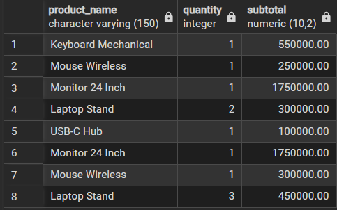
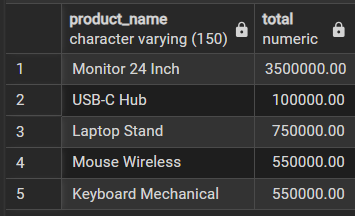
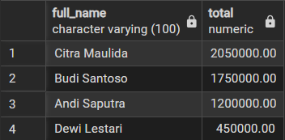

# Mini E-Commerce SQL Database Project

**Display Order Items & Product Name;** 
 
**Display Total Sales each Product;** 
 
**Display Most Customer Purchased;** 

# Desc;
Project latihan SQL beginner, 
RDBMS: PostgreSQL, 
Dataset: Rekayasa sederhana sistem e-commerce, 
Goals: Melatih SELECT, JOIN, GROUP BY.

# Relasi Tabel;
"Customer" dan "Orders" [1-to-Many] | (1 pelanggan dapat memiliki lebih dari 1 order). 
"Orders" dan "Order_items" [1-to-Many] | (1 order bisa berisi lebih dari 1 item). 
"Products" dan "Order_items" [1-to-Many] | (1 produk bisa berada di banyak order).

# Struktur Database;
- Tabel customers
- Tabel products
- Tabel orders
- Tabel order_items

# Tools;
- PostgreSQL + pgAdmin
- VS Code
- GitHub
